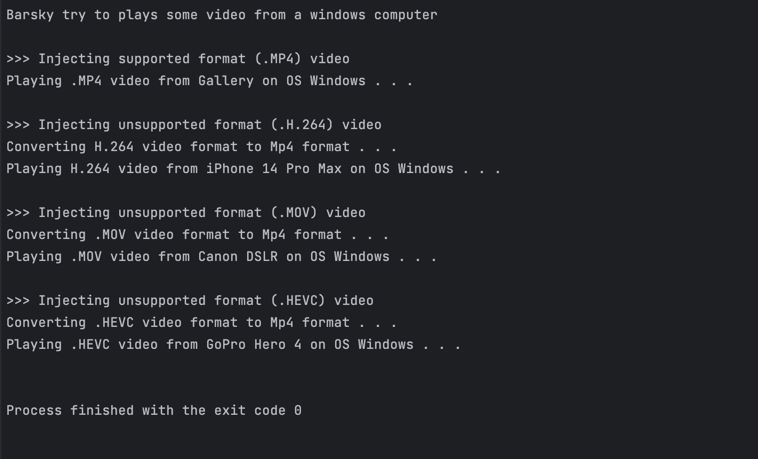

# Design Pattern

This repository had one purpose, to remind me personally to always 
lookup on how-to solve common problems with best practice based on refactoring guru : 

> ***https://refactoring.guru/design-patterns/catalog***

## Steps to run : 
1. Tidy up dependencies
```bash
# we using go modules to fetch our dependencies
go mod tidy
```

2. Choose your desired package to see how it works.
In below picture, we choose package ```structural/adapter``` package :


3. Open **_main.go_** file, and call ```Execute()``` function from these package.
```
package main

import (
	"github.com/ikbarfp/design-pattern/structural/adapter"
)

func main(
    adapter.Execute() // Call this funtion from your desired package
)
```

4. Run it on your local machine and see how it works
```bash
# run your application
go run main.go
```

5. See the logs 
